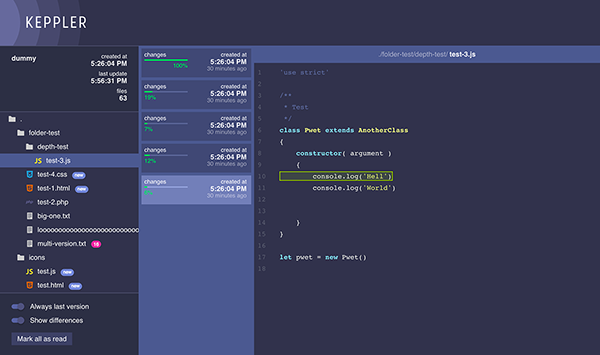

# Keppler

An efficient way to share your code while presenting

### What is keppler

Keppler lets you share your code during a presentation.

Start keppler inside your project folder, share the URL with the viewers and start coding. When you save or change any files, viewers receive them, can browse through the files tree and discover changes you've made.

Keppler is easy to install and works with NodeJS.



### Instructions

**Requirements**
* [NodeJS](https://nodejs.org/en/) installed
* Keppler installed globally
* Viewer connected to the same wifi

**Install Keppler globally**

```
npm install -g keppler
```

**Start Keppler inside the project folder**

```
cd ./my-awesome-project
keppler "My project"
```

The project URL appears. Share it with the viewers on the same wifi.

### Todo

- [ ] Ignore too big files
- [ ] Ignore non txt files
- [ ] NPM package

### Futur features

- 404
- Retractable sidebar
- Open multiple files
- Keyboard navigation
- In app notifications
- Navigator notifications
- Config file
- Unit testing
- Tablet compatible
- File searching/filtering
- Toggle folder
- Tooltips
- Copy file to clipboard
- Download file
- Angular 2